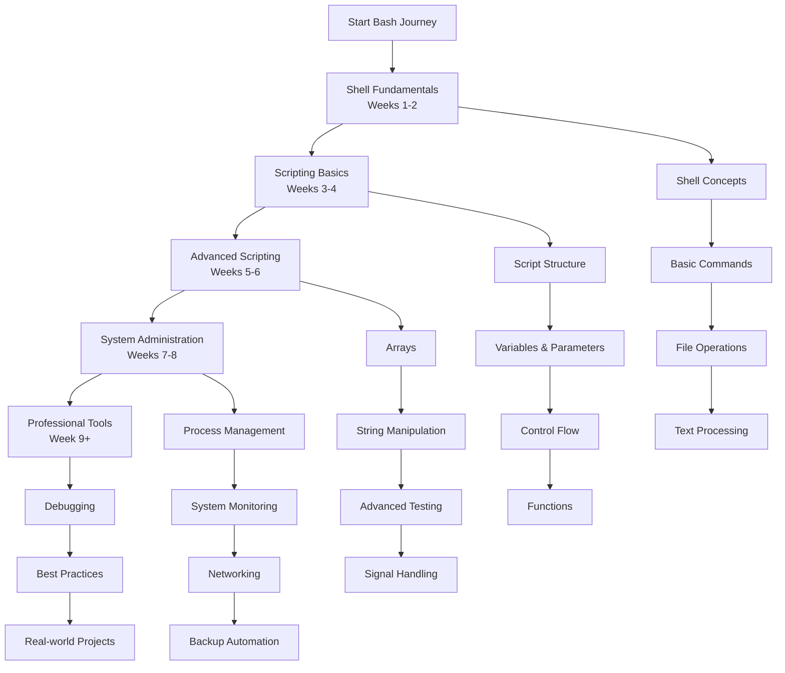

# Bash Shell Scripting Learning Path

This comprehensive roadmap provides a structured approach to mastering Bash shell scripting. The curriculum is designed sequentially, with each module building upon previous knowledge to ensure a solid foundation in command-line proficiency and automation.



---

## Phase 1: Shell Fundamentals & Basic Commands (Weeks 1-2)

*   [**Module 1: Introduction to Shell & Terminal**](https://github.com/example/bash-intro/#readme)
    *   What is a shell? Differences between Bash, Zsh, Fish
    *   Terminal emulators and console basics
    *   Shell configuration files: `.bashrc`, `.bash_profile`, `.profile`
    *   Basic navigation: `pwd`, `ls`, `cd`, `clear`
    *   Command history and tab completion

*   [**Module 2: Essential File Operations**](https://github.com/example/bash-files/#readme)
    *   File manipulation: `cp`, `mv`, `rm`, `mkdir`, `touch`
    *   File viewing: `cat`, `less`, `more`, `head`, `tail`
    *   File permissions: `chmod`, `chown`, `chgrp`
    *   Finding files: `find`, `locate`, `which`, `whereis`
    *   File compression: `tar`, `gzip`, `zip`

*   [**Module 3: Text Processing Tools**](https://github.com/example/bash-text-processing/#readme)
    *   Text filtering: `grep`, `egrep`, `fgrep`
    *   Stream editing: `sed` basic operations
    *   Text transformation: `awk` fundamentals
    *   Sorting and filtering: `sort`, `uniq`, `cut`, `paste`
    *   Word count and line numbers: `wc`, `nl`

*   [**Module 4: Input/Output Redirection**](https://github.com/example/bash-io/#readme)
    *   Standard streams: stdin (0), stdout (1), stderr (2)
    *   Redirection operators: `>`, `>>`, `<`, `<<`
    *   Piping: `|` for command chaining
    *   Here documents and here strings: `<<`, `<<<`
    *   Output teeing: `tee` command

---

## Phase 2: Bash Scripting Basics (Weeks 3-4)

*   [**Module 5: Script Structure & Execution**](https://github.com/example/bash-scripts/#readme)
    *   Shebang line: `#!/bin/bash`
    *   Creating executable scripts: `chmod +x`
    *   Script comments and documentation
    *   Executing scripts: `./script.sh`, `bash script.sh`, `source script.sh`
    *   Debugging with `set -x`, `set -e`, `set -u`

*   [**Module 6: Variables & Parameters**](https://github.com/example/bash-variables/#readme)
    *   Variable assignment and usage: `name=value`, `$name`
    *   Environment variables vs local variables
    *   Positional parameters: `$1`, `$2`, `$@`, `$*`
    *   Special parameters: `$#`, `$?`, `$$`, `$!`
    *   Command substitution: `$(command)` and backticks

*   [**Module 7: Control Flow Statements**](https://github.com/example/bash-control-flow/#readme)
    *   Conditional statements: `if`, `then`, `else`, `elif`, `fi`
    *   Test commands: `test`, `[ ]`, `[[ ]]`
    *   File tests: `-f`, `-d`, `-r`, `-w`, `-x`
    *   String tests: `-z`, `-n`, `=`, `!=`
    *   Numerical tests: `-eq`, `-ne`, `-lt`, `-gt`

*   [**Module 8: Loops & Iteration**](https://github.com/example/bash-loops/#readme)
    *   For loops: `for i in list; do ... done`
    *   C-style for loops: `for ((i=0; i<10; i++))`
    *   While loops: `while condition; do ... done`
    *   Until loops: `until condition; do ... done`
    *   Loop control: `break`, `continue`

---

## Phase 3: Advanced Scripting Techniques (Weeks 5-6)

*   [**Module 9: Arrays & String Manipulation**](https://github.com/example/bash-arrays/#readme)
    *   Array declaration and initialization
    *   Accessing array elements: `${array[index]}`
    *   Array operations: length, slicing, iteration
    *   String operations: length, substring, replacement
    *   Pattern matching with `=~` operator

*   [**Module 10: Functions & Modularity**](https://github.com/example/bash-functions/#readme)
    *   Function definition and invocation
    *   Function parameters and return values
    *   Local variables and variable scope
    *   Sourcing external scripts
    *   Library creation and code organization

*   [**Module 11: Advanced Testing & Conditionals**](https://github.com/example/bash-advanced-testing/#readme)
    *   Compound commands: `&&`, `||`
    *   Case statements: `case ... in ... esac`
    *   Arithmetic expressions: `(( ))` and `let`
    *   Pattern matching advanced techniques
    *   Regular expressions in Bash

*   [**Module 12: Signal Handling & Process Control**](https://github.com/example/bash-signals/#readme)
    *   Process management: `ps`, `top`, `kill`, `pkill`
    *   Signal handling: `trap` command
    *   Background jobs: `&`, `jobs`, `fg`, `bg`
    *   Subshells and process substitution
    *   Exit codes and error handling

---

## Phase 4: System Administration & Automation (Weeks 7-8)

*   [**Module 13: System Monitoring Scripts**](https://github.com/example/bash-system/#readme)
    *   Disk usage monitoring: `df`, `du`
    *   Memory and CPU monitoring scripts
    *   Log file analysis and rotation
    *   User management automation
    *   System health check scripts

*   [**Module 14: Networking & Web Operations**](https://github.com/example/bash-networking/#readme)
    *   Network testing: `ping`, `curl`, `wget`
    *   Port scanning and connection testing
    *   DNS lookup automation
    *   Web scraping with curl and grep
    *   API interaction scripts

*   [**Module 15: Backup & File Management**](https://github.com/example/bash-backup/#readme)
    *   Automated backup scripts with `rsync`
    *   File synchronization strategies
    *   Log rotation and cleanup
    *   Database backup automation
    *   Incremental backup systems

*   [**Module 16: Cron Jobs & Scheduling**](https://github.com/example/bash-scheduling/#readme)
    *   Cron syntax and scheduling
    *   User crontab vs system cron
    *   Logging cron job output
    *   Error handling in scheduled tasks
    *   Systemd timers as cron alternatives

---

## Phase 5: Professional Development & Best Practices (Week 9+)

*   [**Module 17: Debugging & Error Handling**](https://github.com/example/bash-debugging/#readme)
    *   Debugging techniques: `set -x`, `bash -x`
    *   Error handling with `trap` and exit codes
    *   Logging best practices
    *   Input validation and sanitization
    *   Testing frameworks for Bash

*   [**Module 18: Security & Portability**](https://github.com/example/bash-security/#readme)
    *   Secure scripting practices
    *   Handling sensitive data
    *   Script portability across systems
    *   POSIX compliance considerations
    *   Security auditing tools

*   [**Module 19: Advanced Tools & Integration**](https://github.com/example/bash-advanced-tools/#readme)
    *   AWK advanced programming
    *   SED advanced stream editing
    *   JSON processing with `jq`
    *   XML processing tools
    *   Integration with Python and other languages

*   [**Module 20: Real-world Projects**](https://github.com/example/bash-projects/#readme)
    *   **System deployment scripts**
    *   **Database maintenance automation**
    *   **Log analysis and reporting**
    *   **Cloud infrastructure management**
    *   **CI/CD pipeline scripts**

---

## Cheat Sheet: Essential Bash Commands

### File Operations
```bash
ls -la                    # List all files with details
cp -r source dest         # Recursive copy
rm -rf directory          # Force remove directory
find /path -name "*.txt"  # Find files by name
chmod 755 script.sh       # Make script executable
```

### Text Processing
```bash
grep "pattern" file       # Search for pattern
sed 's/old/new/g' file    # Replace text in file
awk '{print $1}' file     # Print first column
sort file | uniq          # Sort and remove duplicates
wc -l file                # Count lines in file
```

### Scripting Essentials
```bash
#!/bin/bash              # Shebang line
name="value"             # Variable assignment
echo "Hello $name"       # Variable expansion
if [ -f "$file" ]; then  # File existence check
for i in {1..10}; do     # Loop through range
```

### System Management
```bash
ps aux | grep process    # Find processes
kill -9 PID              # Force kill process
df -h                    # Disk space human readable
du -sh directory         # Directory size
crontab -l               # List cron jobs
```

---

## Learning Resources

### Official Documentation
- [GNU Bash Manual](https://www.gnu.org/software/bash/manual/) - Complete reference
- [Bash Reference Manual](https://www.gnu.org/savannah-checkouts/gnu/bash/manual/bash.html)
- [Advanced Bash-Scripting Guide](https://tldp.org/LDP/abs/html/)

### Interactive Learning
- [Explain Shell](https://explainshell.com/) - Command explanation
- [ShellCheck](https://www.shellcheck.net/) - Online syntax checker
- [Bash Academy](http://www.bash.academy/) - Interactive tutorials

### Practice Platforms
- [OverTheWire Bandit](https://overthewire.org/wargames/bandit/) - Security-focused practice
- [HackerRank Bash Challenges](https://www.hackerrank.com/domains/shell)
- [Codewars Bash Katas](https://www.codewars.com/?language=shell)

### Books & Courses
- "Linux Command Line and Shell Scripting Bible" by Richard Blum
- "Classic Shell Scripting" by Arnold Robbins
- "The Bash Academy" online course

Remember: Bash proficiency comes from daily practice. Start with simple automation tasks, gradually build more complex scripts, and always test thoroughly in safe environments before deploying to production systems!
